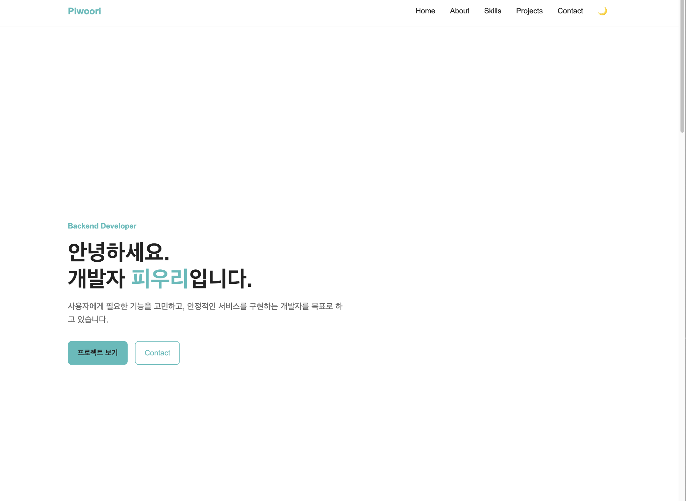
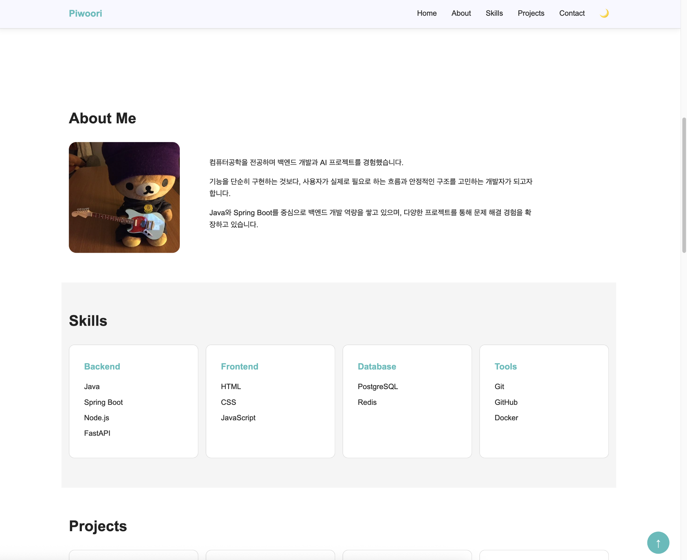
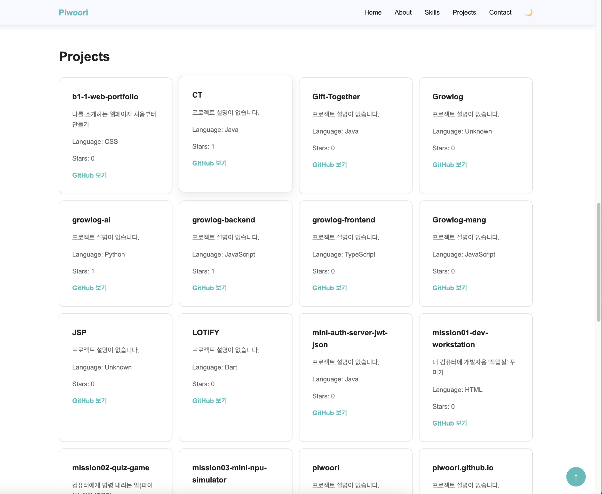
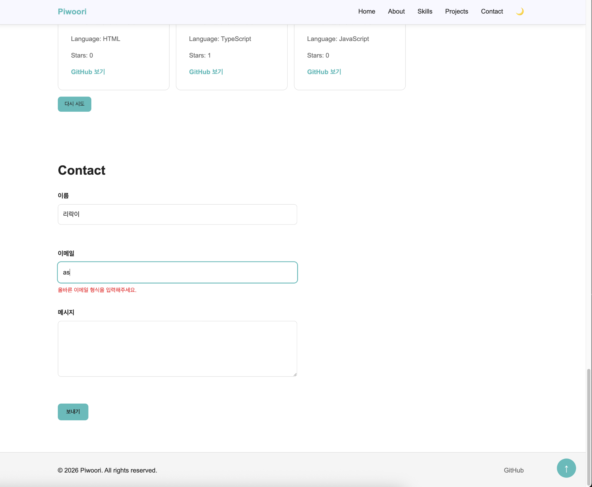
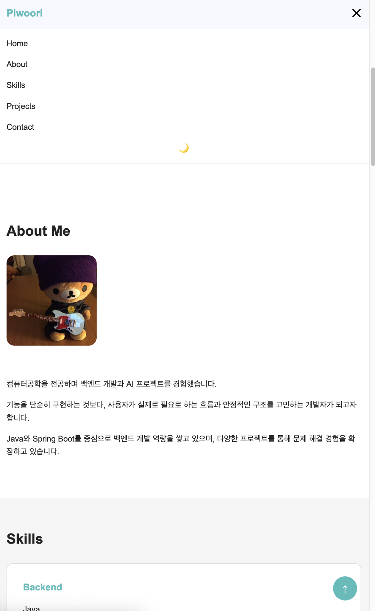
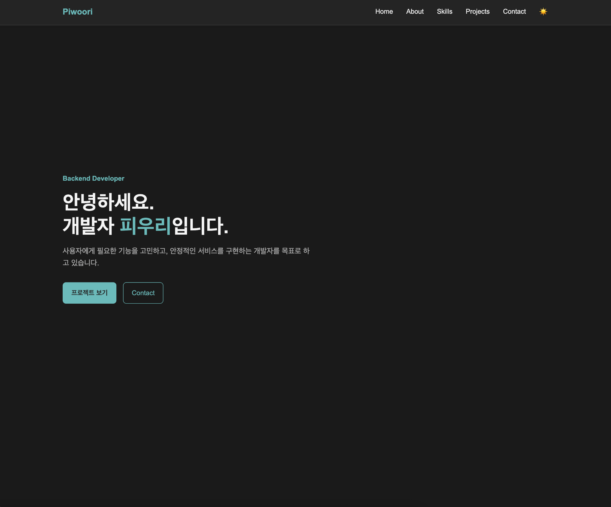

# B1-1 Web Portfolio

HTML, CSS, JavaScript를 활용하여 처음부터 구현한 반응형 개인 포트폴리오 웹페이지입니다.

외부 프레임워크나 라이브러리 없이 웹의 기본 구조와 동작을 직접 구현했으며,
GitHub REST API를 활용하여 사용자의 Repository 정보를 동적으로 불러옵니다.

## 주요 기능

- 반응형 웹 디자인
  - Mobile First
  - Tablet: 768px
  - Desktop: 1024px

- 모바일 햄버거 메뉴
- 부드러운 섹션 이동
- 스크롤 위치에 따른 Header 스타일 변경
- Scroll To Top 버튼
- Intersection Observer를 활용한 스크롤 애니메이션

- Dark Mode
  - LocalStorage를 활용한 테마 상태 저장

- Contact Form 유효성 검사
  - 필수값 검증
  - 이메일 형식 검증
  - 실시간 입력 검증

- GitHub REST API 연동
  - Repository 목록 동적 렌더링
  - Loading / Error / Empty 상태 처리
  - API 요청 실패 시 재시도 기능

## 기술 스택

- HTML5
- CSS3
  - Flexbox
  - Grid
  - CSS Variables
  - Media Queries

- JavaScript (ES6+)
  - DOM API
  - Event Handling
  - Fetch API
  - Async / Await
  - LocalStorage
  - Intersection Observer

- Git / GitHub
- GitHub Pages

## 프로젝트 구조

```text
b1-1-web-portfolio/
├── index.html
├── css/
│   └── style.css
├── js/
│   └── main.js
├── images/
│   ├── profile.jpg
│   ├── desktop.png
│   ├── desktop-2.png
│   ├── desktop-3.png
│   ├── desktop-4.png
│   ├── mobile.png
│   └── dark.png
└── README.md
```

## GitHub API

GitHub REST API를 사용하여 Repository 정보를 불러옵니다.

```text
GET https://api.github.com/users/{username}/repos
```

API 요청 과정에서 다음 상태를 구분하여 UI에 반영했습니다.

- Loading
- Success
- Error
- Empty

## 상태 변화와 DOM 업데이트

사용자의 이벤트에 따라 상태를 변경하고 DOM에 결과를 반영하도록 구현했습니다.

### Dark Mode

테마 변경 → LocalStorage 저장 → 화면 테마 변경

### GitHub Projects

API 요청 → 결과 상태 확인 → 프로젝트 목록 또는 상태 메시지 렌더링

### Contact Form

사용자 입력 → 유효성 검사 → 오류 또는 성공 메시지 렌더링

## 레이아웃 설계 기준

### Flexbox

Navigation, Hero 버튼, About, Footer처럼 한 방향으로 요소를 정렬하는 영역에는 Flexbox를 사용했습니다.

`align-items`, `justify-content`, `flex-direction`을 활용하여 요소의 정렬 방향과 간격을 쉽게 제어할 수 있기 때문에 적용했습니다.

### CSS Grid

Skills와 Projects처럼 여러 개의 카드를 행과 열 형태로 배치하는 영역에는 CSS Grid를 사용했습니다.

특히 Projects 영역은 `auto-fit`과 `minmax()`를 사용하여 화면 너비에 따라 카드의 열 개수가 자동으로 변경되도록 구현했습니다.

## 상태 관리 흐름

GitHub Repository 데이터를 불러오는 기능은 `STATE` 객체를 통해 상태를 관리합니다.

```text
사용자 이벤트 또는 API 요청
        ↓
STATE 변경
        ↓
renderProjectState()
        ↓
DOM 업데이트
```

## 배포

GitHub Pages를 통해 배포했습니다.

- Deploy URL: https://piwoori.github.io/b1-1-web-portfolio/

## Screenshots

### Desktop









### Mobile



### Dark Mode

